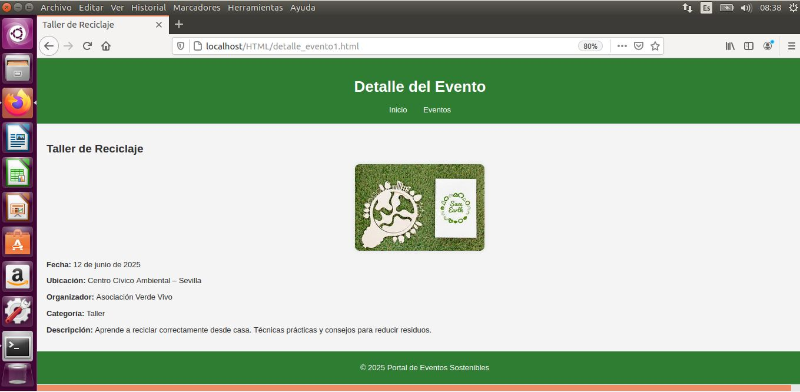

# Proyecto Gestion de eventos sostenibles

Este es mi proyecto realizado en las practicas en la empresa MINSAIT en el curso 2024-2025 de 1º
de DAM, en el se nos pidio demostrar nuestros conocimientos en distintos campos, relacionados con
las asignaturas dadas en el centro.

## Tabla de Contenidos

- Estructura de el directorio de GITHUB
- Explicacion de la parte HTML
- Explicacion de la parte C#
- Explicacion de la parte SQL
- Explicacion de la parte de Sistemas Informaticos
- Explicacion de la parte de Entornos de desarrollo

## Estructura

A continuacion esta la estructura usada en este proyecto, especificando los contenidos ubicados en cada carpeta.

DOC: Aqui se encuentran los documentos de sistemas informaticos, detallando la preparacion e instalacion de una maquina virtual de Ubuntu 16.

    -Creación Máquina Virtual.pdf
    -Instalacion S.O Ubuntu.pdf

HTML: Aqui se encuentran los archivos html que forman la pagina web estatica de este proyecto los cuales son: el index.html, la tabla de eventos, y los archivos propios de cada evento, todo junto al archivo css.

    -css
        -style.css
    -detalle_evento1.html
    -detalle_evento2.html
    -detalle_evento3.html
    -eventos.html
    -index.html

SQL: Aqui se encuentran los varios archivos detallando la base de datos de el proyecto, el archivo para la reacion de la base y las tablas y una imagen de el diagrama entidad relacion.

    -Codigo Base de datos proyectos.sql
    -Diagrama1.dia
    -Imagen_E-R.png
    -Tablas SQL.pdf

SRC/MAIN: Aqui se encuentran los archivos de la programacion del proyecto, dado que lo que nos pidieron son solo las clases pero en clase acostumbramos a subir todo el proyecto he decidido agregar en esta carpeta el proyecto de Visual Studio Community junto a las clases separadas.

    -Proyecto Indra [Carpeta con el proyecto VSC completo]
    -Administrador.cs
    -Categoria.cs
    -Cliente.cs
    -Evento.cs
    -Inscripcion.cs
    -Persona.cs
    -Program.cs
    -Ubicacion.cs

EXTRAS-RM: Aqui se encuentran las diferentes imagenes integradas en el README, aunque esta carpeta no estaba indicada en el proyecto, he visto conveniente su inclusion.

## Explicaciones

Dado que el documento proporcionado puede llevar a varias formas de comprension y que esto lleve a distintas soluciones, he visto correcto el agregar una explicacion a las soluciones que yo doy a cada seccion de el proyecto.

# Parte HTML

En la parte de HTML cullos requisitos proporcionados fueron los siguientes:
HTML y CSS: Los alumnos deben desarrollar una página web con tres secciones:
-Página principal: Presentación del portal y un carrusel de eventos destacados.
-Página de listado de eventos: Una tabla/listado con todos los eventos, incluyendo el nombre, la fecha, y unavbreve descripción.
-Página de detalle del evento: Cada evento en el listado lleva a una página de detalle con nformación más completa (ubicación, organizadores, imagen del evento, etc.).
Requisitos:
• Uso adecuado de etiquetas semánticas HTML5.
• Diseño en CSS.
• Todas las páginas web serán estáticas.

Yo lo que hize fue una pagina de index, la cual contiene un carrusel con 3 imagenes, las cuales cada una simboliza un evento, y las cuales tienen enlaces integrados, cada una a uno de los 3 eventos totales que he creado.

Seguido de esto hay una pagina con una tabla listando todos los eventos incluidos y una pagina por evento, con informacion detallada sobre que va ese evento, aqui a continuacion dejo las imagenes de como queda la pagina en el servidor local de la maquina virtual, con una imagen de el index, de la tabla y una de un evento.

# Parte de C#

En la seccion de programacion se nos pedia programas con java, dado que lo dado en el centro era C#, lo he realizado con este, los requisitos eran los siguientes:

El objetivo principal de este ejercicio es que apliques los conceptos fundamentales de la programación orientada a objetos, el uso modular para organizar tu código, y la manipulación de vectores (arreglos) para gestionar los datos de manera eficiente.

    -Lenguaje de programación: El desarrollo se realizará en el lenguaje que estás utilizando en tu formación actual, utilizando Visual Studio Code.
    -Programación orientada a objetos: Se espera que sigas el paradigma de la programación orientada a objetos, también el uso de la programación estructurada - utilizando bloques lógicos y evitando estructuras complejas o desorganizadas.
    -Modularidad: La solución deberá dividirse en funciones o procedimientos que aborden tareas específicas del programa.
    -Uso de vectores: Los vectores o arreglos deben emplearse para almacenar y manipular conjuntos de datos

Mi resultado fue un proyecto de VSC con 8 clases, las cuales son:

    -Persona.cs: Clase base que contiene los atributos comunes a todos los usuarios del sistema (ID, nombre, email y contraseña).
    -Administrador.cs: Hereda de Persona y añade funcionalidad para crear y cancelar eventos. Mantiene una lista de eventos creados.
    -Cliente.cs: También hereda de Persona, con capacidad para inscribirse y cancelar inscripciones en eventos. Guarda una lista de eventos a los que está inscrito.
    -Evento.cs: Representa un evento con sus propiedades (nombre, fecha, duración, ubicación, categoría) y métodos para gestionarlo.
    -Categoria.cs y Ubicacion.cs: Clases de apoyo que definen categorías y ubicaciones para los eventos.
    -Inscripcion.cs: Registra la relación entre un cliente y un evento, incluyendo la fecha de inscripción.
    -Program.cs: Contiene el método principal que demuestra el funcionamiento del sistema.

El programa final permite la creacion de eventos, inscripcipcion de clientes, cancelacion de tanto eventos como inscripciones, y mantiene un registro de los cliente inscritos en cada evento

# Parte de SQL

El apartado de bases de datos pedia lo siguiente:

Se deberá de realizar el diagrama entidad-relación con una herramienta software (la utilizada en el instituto, se debe indicar cual es finalmente la utilizada) acompañado de la tabla de descripción de entidades que se adjunta a continuación y el diseño físico de la base de datos en un script SQL con al menos 6 tablas. Se debe aportar información detallada de cada una de las tablas, rellenando para cada una de ellas una tabla.

Mi resultado, como lo pedido, es un codigo SQL el cual crea una base de datos y crea dentro de esta 6 tablas, Usuario, Organizacion, Categoria, Ubicacion y Evento.

Dentro de la carpeta tambien se encuenta el archivo de la aplicacion usada para hacer el diagrama E-R, el cual yo realice con la aplicacion DIA, una foto de el diagrama y el pdf con las tablas rellenadas de todas las tablas.

# Parte de Sistemas Informaticos

El apartado de sistemas informaticos pedia lo siguiente:

Realizar una instalación de Windows 10 en una máquina virtual.
Crear un servidor web a nivel local en el sistema operativo Windows 10.
Para ello, utilizaremos la herramienta que hemos visto en nuestro instituto (indicar cual es la herramienta utilizada). Deben realizarse una serie de capturas para realizar unas evidencias del proceso tanto de instalación como del resultado de la parte desplegada con la herramienta.

Propuesta de evidencias sugeridas:

    -Captura de la configuración de la máquina virtual.
    -Captura de las pantallas de instalación de Windows 10 (selección de idioma, particiones y configuración inicial).

Mi resultado a este apartado fueron dos pdf, uno sobre la creacion de la maquina virtual y otro sobre la instalacion de ubuntu en la maquina

# Parte de Entornos de Desarrollo

Conforme se ha realizado la implementación del ejercicio, se requiere que todo el código desarrollado, junto con la documentación complementaria, se haya gestionado a través de un repositorio personal en GitHub. Este paso es fundamental para practicar la gestión de proyectos en un sistema de control de versiones y para consolidar las habilidades relacionadas con el uso de Git.

    -Creación del repositorio en GitHub
    -Uso de Ramas a lo largo del proyecto. Deberás estructurar el desarrollo del proyecto utilizando ramas en Git
    para reflejar las diferentes etapas del trabajo
    -Subir el grafo de ramas

Mi respuesta a este apartado fue la creacion de este directorio de GitHub y el grafo de ramas que muestro a contnuacion.

